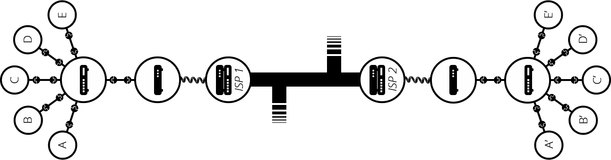
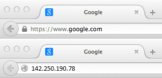

## The information is based on the `mdn web docs`.

# Internet.
### `Internet` is the backbone of the web.
###  It is the technical infrastructure  that makes the web possible.
### Basically, the `internet` is a large network of computers, which  communicate all together.

# A simple network
### When two computer connected to each other inorder to establish communication between them.

### We can connect as many as computers as we wish, but it gets complicated with increasing the numbers of computers.
### For example :
###### If we're trying to connect, say, ten computers, you need 45 cables, with nine plugs per computer.

### So, we have very complex network here, to solve this problem `router` comes into picture
### `router` is a special specialized networking device , whose only job is to show path to `data` or `information`(it can be text, video, audio ,etc.)
### It makes sure that a data sent from a given computer arrives at the right destination computer.
### To send a message to computer B, computer A must send the message to the `router`, which in turn forwards the message to computer B and makes sure the message is not delivered to some other computer.
### It also reduces the complexity of network 
### For example :
##### After adding `router` our network of 10 computers only requires 10 cables: a single plug for each computer and a router with 10 plugs.

### But what if we need to connect 100s or 1000s of computers together?
### Again to solve the complexity issue, we will connect the `routers` with each other (as it is also a tiny computer)

### By connecting computers to routers, then routers to routers, we are able to scale infinitely.

### So, we have built this our giant network of computers, but it still not connected to the outside world.
### To connect it to outside world we need additional infrastructure i.e. Telephone infrastructure to achieve this `modem` also known as `dongle` (modem in USB form).
### We need `modem` to connect our computer to telephone infrastructure.
### This `modem` turns the information from our network into information manageable by the telephone infrastructure and vice versa.

### To send the data/information from our network to the network we want to reach, we will connect our network to an `Internet Service Provider (ISP)`.
### An `ISP` is a company that manages some special routers that are all linked together and can also access other ISPs' routers.
### the message from our network is carried through the network of ISP networks to the destination network. 
### The `Internet` consists of this whole infrastructure of networks.

## Finding Computers : 
### To send the data we need an address of the destination computer, so here `IP Address` comes into picture.
### IP stands for `Internet Protocol`. It is a set of rules and standards that define how information is exchanged between systems.
### IP address is an address made of a series of four numbers separated by dots i.e. `192.0.2.172`
### It is tough to remember multiple addresses of this type. So, to solve this problem `Domain name` comes into picture.
### To make things easier, we can alias an IP address with a human-readable name called a `domain name`.
### For example :
###### google.com is the domain name used on top of the IP address 142.250.190.78.

## Is the Internet and the Web are the same thing ?
### The Internet is an infrastructure, whereas the Web is a service built on top of the infrastructure.

## Additional Key Points:

### 1. **Protocols and Layers of the Internet:**
- The Internet is built on a series of protocols, which are standardized rules for data transmission. The two most important protocols are **Transmission Control Protocol (TCP)** and **Internet Protocol (IP)**.
- The TCP/IP model organizes communication tasks into layers, including:
    - **Application Layer:** Where web browsers and email clients operate.
    - **Transport Layer:** Handles data flow control and error-checking (e.g., TCP).
    - **Internet Layer:** Manages addressing and routing (e.g., IP).
    - **Link Layer:** Deals with the physical transmission of data over networks.

### 2. **Domain Name System (DNS):**
- DNS is like the phonebook of the Internet. When you type a domain name (e.g., google.com) in a browser, DNS translates it to an IP address, allowing the browser to locate the correct server.
- DNS servers are distributed across the world, organized in a hierarchical structure.

### 3. **Internet Exchange Points (IXPs):**
- IXPs are physical locations where different networks and ISPs connect to exchange traffic. This helps improve speed and reduce costs by routing data efficiently.

### 4. **Security on the Internet:**
- **Encryption:** Data is often encrypted during transmission using protocols like HTTPS (HTTP Secure), ensuring that sensitive information remains private.
- **Firewalls:** Networks use firewalls to protect against unauthorized access and cyber attacks.

### 5. **Types of Internet Connections:**
- **Dial-up:** An older, slower method of connecting via telephone lines.
- **Broadband:** High-speed connections like DSL, cable, and fiber-optic.
- **Wireless:** Includes Wi-Fi and cellular data networks (e.g., 4G, 5G).

### 6. **The Evolution of the Internet:**
- **ARPANET:** The precursor to the Internet, developed in the 1960s, which initially connected universities and research labs.
- **World Wide Web:** Introduced in 1989 by Tim Berners-Lee, the web allowed for the creation of websites accessible via browsers, turning the Internet into the global system we use today.

### 7. **Internet Governance:**
- The Internet is governed by various organizations like **ICANN** (Internet Corporation for Assigned Names and Numbers), which manages domain names, and **IETF** (Internet Engineering Task Force), which develops and promotes Internet standards.

### 8. **Internet of Things (IoT):**
- The IoT refers to a growing network of devices (beyond computers and smartphones) that are connected to the Internet, including smart home devices, wearables, and even industrial equipment.

